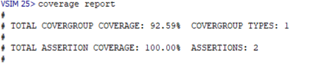
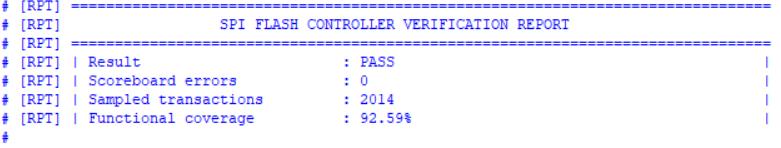
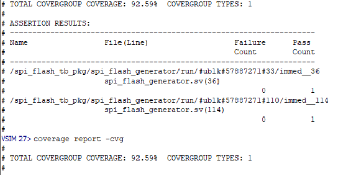
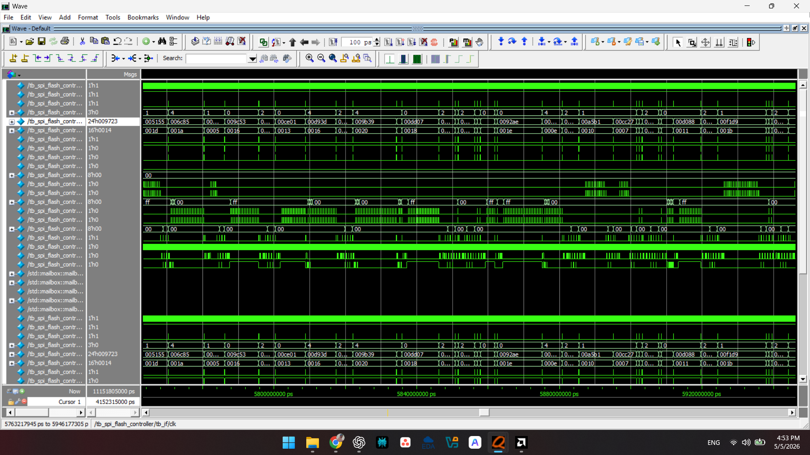

# SPI NOR Flash Controller using SystemVerilog

## Overview

This project focuses on the design and verification of an SPI NOR Flash Controller using SystemVerilog. The controller supports SPI flash operations such as read, page program, sector erase, status register read, and JEDEC ID read.

A complete SystemVerilog-based verification environment was developed with constrained-random verification, assertions, scoreboard checking, and functional coverage collection.

Simulation and debugging were performed using QuestaSim.

---

# Features

## SPI NOR Flash Operations
- Read Operation
- Page Program Operation
- Sector Erase Operation
- Read Status Register
- Read JEDEC ID

## Verification Features
- SystemVerilog Class-Based Testbench
- Constrained Random Verification
- Directed Testcases
- Functional Coverage
- Cross Coverage
- Assertion-Based Verification
- Scoreboard Validation
- Monitor and Driver Architecture

---

# Verification Architecture

The verification environment consists of:

- Transaction
- Generator
- Driver
- Monitor
- Scoreboard
- Coverage Collector
- Assertions
- Environment
- Test

---

# Block Diagram

The following block diagram illustrates the architecture of the SPI NOR Flash Controller along with the SystemVerilog-based verification environment.

It shows:
- SPI NOR Flash Controller internal architecture
- Host/System interface
- SPI communication signals
- Flash memory model
- Verification components such as generator, driver, monitor, scoreboard, assertions, and coverage collector

## SPI NOR Flash Controller Architecture


---

## Block Diagram Description

### DUT (SPI NOR Flash Controller)

The DUT consists of:
- Command Decoder
- Address Manager
- SPI Engine
- Control Logic & FSM
- Data Buffer
- Status Register
- Clock Generator
- SPI Interface

The controller communicates with the SPI NOR Flash memory using:
- SCLK
- MOSI
- MISO
- CS_N

---

### Verification Environment

The SystemVerilog verification environment includes:
- Generator
- Driver
- SPI Interface
- Monitor
- Scoreboard
- Assertions
- Functional Coverage

The verification architecture validates protocol behavior, data integrity, error handling, and corner-case scenarios using constrained-random verification and assertion-based checking.

---

# Functional Coverage Result

| Metric | Result |
|---|---|
| Functional Coverage | **92.59%** |
| Assertion Coverage | **100%** |
| Scoreboard Errors | **0** |
| Sampled Transactions | **2014** |

---

# Tools Used

- SystemVerilog
- QuestaSim
- Functional Coverage
- SystemVerilog Assertions (SVA)

---

# Project Structure

```text
SPI_NOR_FLASH_CONTROLLER_SV/
│
├── RTL/
│   ├── spi_flash_controller.sv
│   ├── spi_flash_if.sv
│   └── spi_flash_model.sv
│
├── TB/
│   ├── spi_flash_transaction.sv
│   ├── spi_flash_generator.sv
│   ├── spi_flash_driver.sv
│   ├── spi_flash_monitor.sv
│   ├── spi_flash_scoreboard.sv
│   ├── spi_flash_coverage.sv
│   ├── spi_flash_assertions.sv
│   ├── spi_flash_env.sv
│   ├── spi_flash_test.sv
│   ├── spi_flash_tb_pkg.sv
│   └── tb_spi_flash_controller.sv
│
├── Simulation_Output/
│   ├── functional_coverage.png
│   ├── verification_report.png
│   ├── assertion_coverage.png
│   └── waveform_output.png
│
└── README.md
```

---

# Compile and Run

## Compile

```tcl
vlib work
vmap work work

vlog spi_flash_if.sv
vlog spi_flash_controller.sv
vlog spi_flash_model.sv
vlog spi_flash_tb_pkg.sv
vlog spi_flash_assertions.sv
vlog tb_spi_flash_controller.sv
```

## Simulate

```tcl
vsim -coverage tb_spi_flash_controller
```

## Run Simulation

```tcl
run -all
```

## Coverage Report

```tcl
coverage report -details
```

---

# Simulation Results

## Functional Coverage


---

## Verification Report


---

## Assertion Coverage


---

## Waveform Output


---

# Key Achievements

- Designed and verified an SPI NOR Flash Controller using SystemVerilog.
- Developed a reusable class-based verification environment.
- Implemented constrained-random and directed verification techniques.
- Achieved **92.59% Functional Coverage**.
- Performed assertion-based verification and scoreboard validation.
- Verified corner cases and protocol behavior using QuestaSim.

---

# Future Enhancements

- UVM-based Verification Environment
- QSPI Support
- Regression Automation
- Enhanced Coverage Closure
- Advanced Assertion Checks

---

# Author

**Manoj Kumar Naik Mudu**
